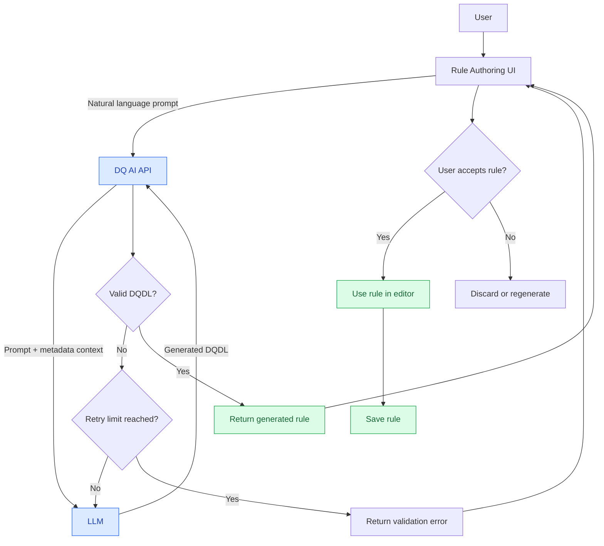

```mermaid
flowchart TD
    U["User"] --> UI["Rule Authoring UI"]
    UI -->|"Natural language prompt"| API["DQ AI API"]
    API -->|"Prompt + metadata context"| LLM["LLM"]
    LLM -->|"Generated DQDL"| API
    API --> V{"Valid DQDL?"}
    V -->|No| R{"Retry limit reached?"}
    R -->|No| LLM
    R -->|Yes| E["Return validation error"]
    V -->|Yes| O["Return generated rule"]
    O --> UI
    E --> UI
    UI --> A{"User accepts rule?"}
    A -->|Yes| S["Use rule in editor"]
    A -->|No| D["Discard or regenerate"]
    S --> P["Save rule"]

    classDef ai fill:#dbeafe,stroke:#2563eb,color:#1e40af
    classDef good fill:#dcfce7,stroke:#16a34a,color:#166534
    class API,LLM ai
    class O,S,P good
```
