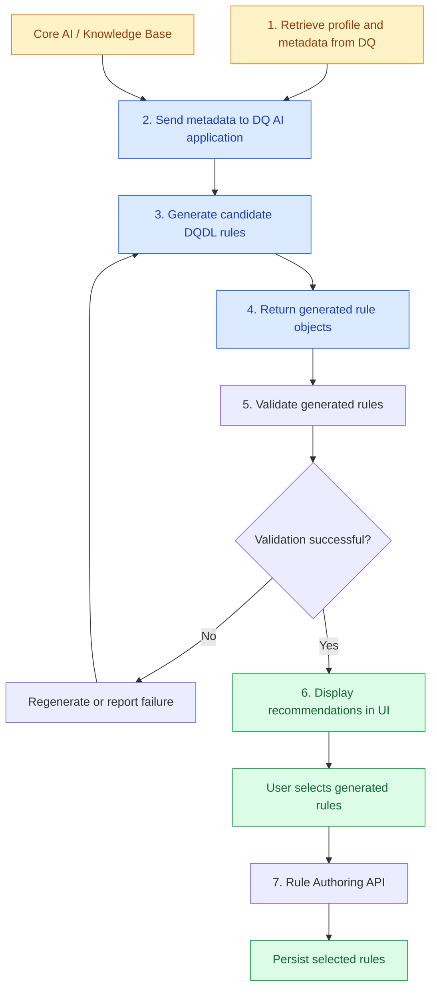

```mermaid
flowchart TD
    A["1. Retrieve profile and metadata from DQ"] --> B["2. Send metadata to DQ AI application"]
    K["Core AI / Knowledge Base"] --> B
    B --> C["3. Generate candidate DQDL rules"]
    C --> D["4. Return generated rule objects"]
    D --> E["5. Validate generated rules"]
    E --> F{"Validation successful?"}
    F -->|No| G["Regenerate or report failure"]
    G --> C
    F -->|Yes| H["6. Display recommendations in UI"]
    H --> I["User selects generated rules"]
    I --> J["7. Rule Authoring API"]
    J --> L["Persist selected rules"]

    classDef metadata fill:#fef3c7,stroke:#d97706,color:#92400e
    classDef ai fill:#dbeafe,stroke:#2563eb,color:#1e40af
    classDef success fill:#dcfce7,stroke:#16a34a,color:#166534
    class A,K metadata
    class B,C,D ai
    class H,I,L success
```
