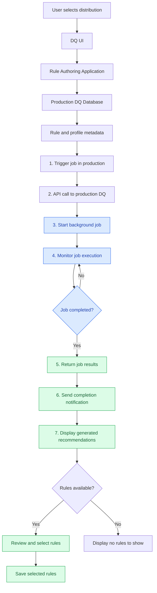

```mermaid
flowchart TD
    U["User selects distribution"] --> UI["DQ UI"]
    UI --> APP["Rule Authoring Application"]
    APP --> DB["Production DQ Database"]
    DB --> T["Rule and profile metadata"]

    T --> A["1. Trigger job in production"]
    A --> B["2. API call to production DQ"]
    B --> C["3. Start background job"]
    C --> D["4. Monitor job execution"]
    D --> E{"Job completed?"}
    E -->|No| D
    E -->|Yes| F["5. Return job results"]
    F --> G["6. Send completion notification"]
    G --> H["7. Display generated recommendations"]
    H --> I{"Rules available?"}
    I -->|Yes| J["Review and select rules"]
    I -->|No| K["Display no rules to show"]
    J --> L["Save selected rules"]

    classDef async fill:#dbeafe,stroke:#2563eb,color:#1e40af
    classDef result fill:#dcfce7,stroke:#16a34a,color:#166534
    class C,D,E async
    class F,G,H,J,L result
```
